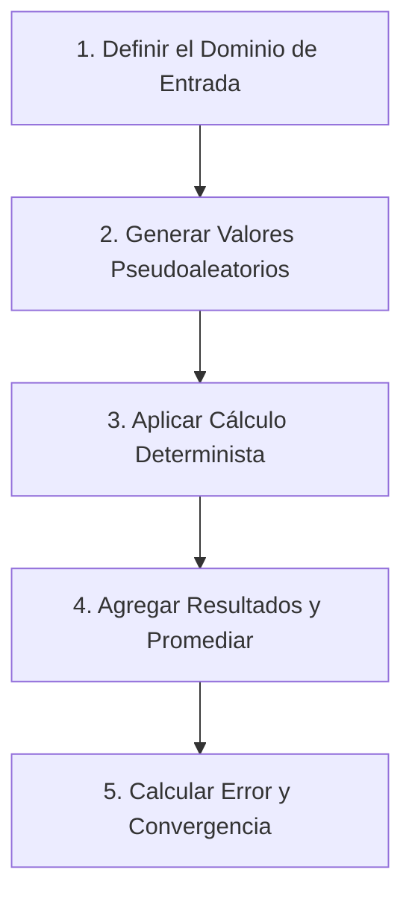

# Investigación del Método Montecarlo

## 1. Introducción y Origen Histórico

El **Método Montecarlo** es un método no determinista o numérico estadístico utilizado para aproximar soluciones de problemas matemáticos complejos a través del uso de variables aleatorias. 

### Origen
Fue acuñado en la década de 1940 por el matemático polaco **Stanislaw Ulam**, mientras trabajaba en el Proyecto Manhattan en el Laboratorio Nacional de Los Álamos. Ulam estaba convaleciente de una cirugía y jugaba solitarios para pasar el tiempo. Al intentar calcular matemáticamente la probabilidad de ganar un solitario completo de 52 cartas, descubrió que resolverlo por combinatoria pura era extremadamente complejo. En su lugar, pensó que sería más sencillo simular de manera práctica 100 partidas individuales y contar la cantidad de victorias.

Esta idea de resolver problemas matemáticos mediante experimentos repetidos con números aleatorios fue formalizada junto con **John von Neumann** y **Nicholas Metropolis**. Metropolis sugirió el nombre "Montecarlo" en honor al famoso Casino de Montecarlo en Mónaco, debido a que el tío de Ulam solía pedir dinero prestado a familiares para jugar allí, y el comportamiento de los juegos de azar (como la ruleta) es el ejemplo por excelencia de la generación de números aleatorios.

---

## 2. Fundamento Matemático

El método se basa directamente en dos pilares fundamentales de la teoría de probabilidad:

### A. Ley Fuerte de los Grandes Números
Establece que si realizamos un número extremadamente grande de pruebas independientes de un mismo experimento, la media aritmética de los resultados observados convergerá casi con seguridad al valor esperado teórica ($\mu$):

$$\lim_{N \to \infty} \frac{1}{N} \sum_{i=1}^{N} X_i = \mathbb{E}[X] = \mu$$

### B. Teorema del Límite Central
Establece que para variables independientes e idénticamente distribuidas (i.i.d.) con media $\mu$ y varianza $\sigma^2$, la distribución del error de estimación se aproxima a una distribución normal. Esto implica que la velocidad de convergencia o el error del método de Montecarlo decrece de acuerdo a la relación:

$$\text{Error} \approx \mathcal{O}\left(\frac{1}{\sqrt{N}}\right)$$

Donde $N$ es el número de muestras aleatorias. Para reducir el error a la mitad, se requiere multiplicar por cuatro el número de simulaciones.

---

## 3. Algoritmo General de Simulación

Aunque el método Montecarlo se aplica a una infinidad de problemas (física nuclear, finanzas, optimización, gráficos por computadora), la estructura del algoritmo general para una estimación consta de los siguientes pasos básicos:

1. **Definir el dominio de entrada:** Establecer el rango de valores admisibles para el problema (ej. un intervalo $[a, b]$ o un área bidimensional).
2. **Generar valores aleatorios (muestreo):** Obtener números pseudoaleatorios distribuidos de manera uniforme (o según la distribución requerida) en el dominio definido.
3. **Realizar un cálculo determinista:** Evaluar cada punto o muestra bajo la función o el modelo bajo estudio.
4. **Agregar los resultados:** Consolidar las evaluaciones individuales (por ejemplo, contar cuántos puntos cumplieron una condición o calcular el promedio aritmético).
5. **Calcular la estimación final:** Obtener la aproximación final y cuantificar el margen de error.

---

## 4. Generación de Números Pseudoaleatorios

El éxito de una simulación de Montecarlo depende críticamente de la calidad de los números generados. Dado que las computadoras son máquinas lógicas deterministas, no pueden generar aleatoriedad pura. En su lugar, utilizan algoritmos conocidos como **Generadores de Números Pseudoaleatorios (PRNG)**.

| Algoritmo | Descripción | Ventajas | Desventajas |
| :--- | :--- | :--- | :--- |
| **Generador Congruencial Lineal (LCG)** | Basado en una relación de recurrencia lineal por módulos: $X_{n+1} = (aX_n + c) \pmod m$. | Muy rápido, requiere mínima memoria. | Periodo relativamente corto; los números muestran correlaciones en dimensiones altas. |
| **Mersenne Twister (MT19937)** | Basado en relaciones de recurrencia en campos finitos. Es el estándar en lenguajes como Python, C++ y MATLAB. | Periodo extremadamente largo ($2^{19937}-1$) y alta uniformidad dimensional (hasta dimensión 623). | No es criptográficamente seguro (no apto para seguridad digital). |
| **Generadores Criptográficos (CSPRNG)** | Utilizan entropía de hardware combinada con funciones hash o cifrados seguros. | Totalmente impredecible, ideal para seguridad. | Significativamente más lento para simulaciones científicas masivas. |

*Nota:* Si un PRNG posee un periodo corto, los números comenzarán a repetirse en patrones predecibles, arruinando la validez estadística de simulaciones grandes donde $N$ puede ser de miles de millones de iteraciones.

---

## 5. Comparativa: Métodos Deterministas vs. Montecarlo

Para problemas en dimensiones bajas (por ejemplo, calcular una integral unidimensional $\int f(x)dx$), los métodos deterministas tradicionales (como la regla de Simpson o del trapecio) son mucho más eficientes y rápidos. Sin embargo, en dimensiones altas, los métodos deterministas sufren de la **"maldición de la dimensionalidad"** ($O(N^d)$), mientras que Montecarlo mantiene su convergencia independiente de las dimensiones.

| Criterio | Métodos Deterministas (Simpson/Trapecio) | Método de Montecarlo |
| :--- | :--- | :--- |
| **Naturaleza** | Matemática exacta, fórmulas geométricas fijas. | Muestreo estadístico y experimental. |
| **Error (1D)** | $O(1/N^2)$ o $O(1/N^4)$ (Muy bajo). | $O(1/\sqrt{N})$ (Moderado). |
| **Escalabilidad en d-dimensiones** | Exponencial ($O(N^{-k/d})$). Pierde precisión rápidamente. | Independiente de la dimensión ($O(1/\sqrt{N})$). Excelente para problemas multidimensionales. |
| **Geometría del dominio** | Difícil de aplicar en fronteras irregulares. | Se adapta fácilmente a cualquier dominio complejo mediante filtros de pertenencia. |
